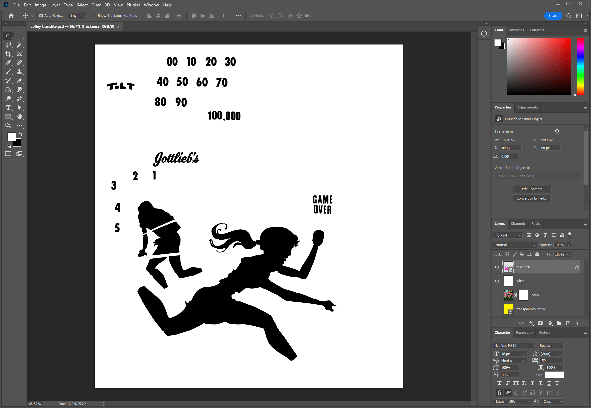

# Finding Artwork

Perhaps the most challenging aspect to making a working backglass is finding good artwork. The best possible art is a direct scan of the backglass but that is not always possible. There are backglass images that can be found online but it takes a fair amount of time to clean these up and remove any artifacts from them. Another possibility is to get artwork online and use that as a basis for a total redraw.

## Create the Color Map

Once you have your artwork secured save this as a PNG file. We'll name it `Backglass Albedo.png` since it'll become our diffuse, or color map. Make sure that the areas for the score reels and credit reel set as transparent. Also be sure to size the backglass image to the size of the original backglass, in the case of Volley this is 19 ¾" x 22".

## Create the Thickness Mask

To block the passage of light through the backglass we need to make a thickness map layer. This layer consists of pure white for the areas that are opaque and pure black for the areas that are transparent. If you have physical access to the backglass then you can scan the backside to get this mask. Otherwise, you'll have to trace what's visible on the front, and try to reconstruct elements that aren't. 

Elements that aren't visible are often scores that aren't part of the actual artwork. In this case, your best bet is to find a similar font to the original art and eyeball where it goes. A helpful site is [WhatTheFont](https://www.myfonts.com/WhatTheFont/), which helps you identify the font in an image.

Save this as a grayscale PNG file without transparency named `Backglass Thickness.png`. 

You're now ready to [create a backglass mesh](xref:tutorial_backglass_2).
