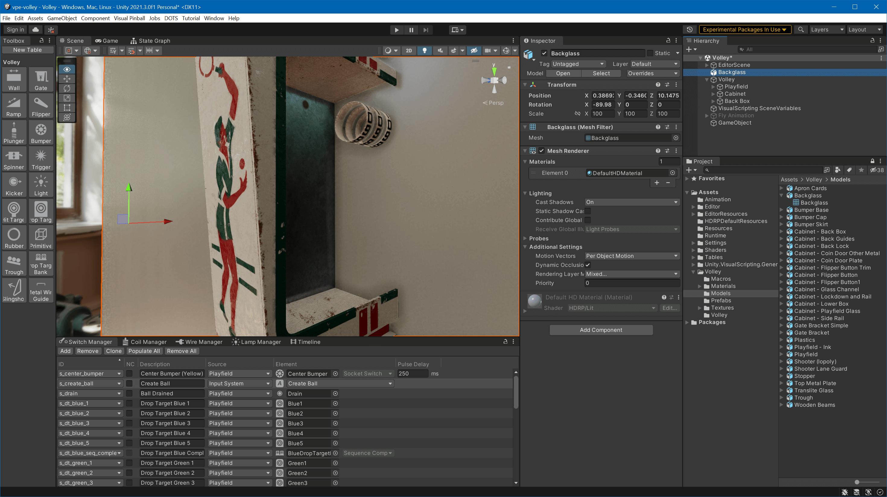
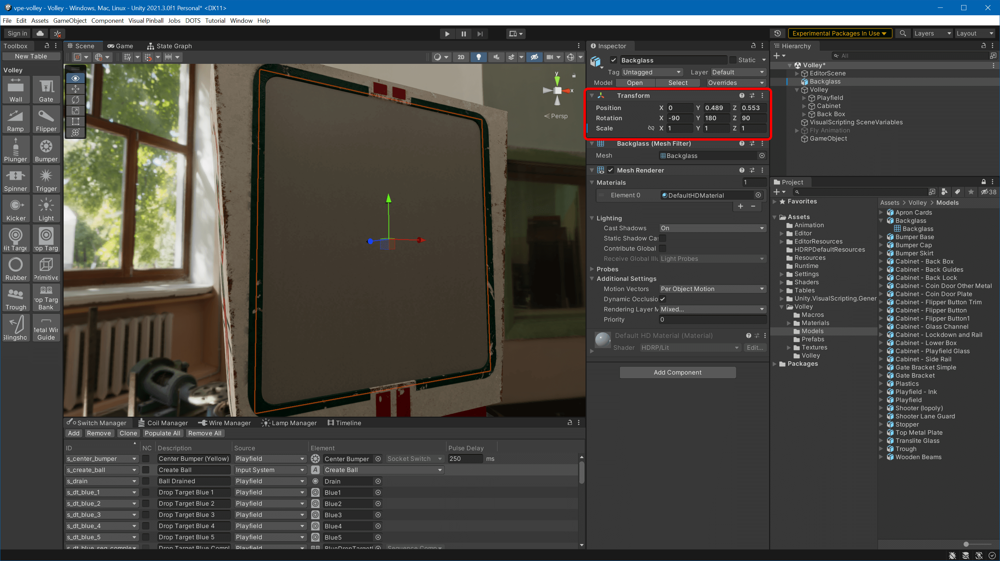
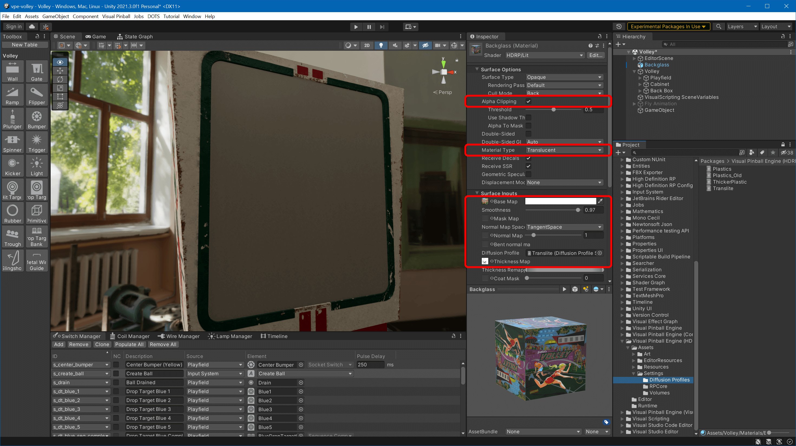

# Import Into Unity

## Import Your Assets

Open your scene in Unity and copy the `Backglass.fbx` into your models folder, and `Backglass Albedo.png` as well as `Backglass Thickness.png` into the textures folder. You can do that by dragging the files from the file explorer into Unity's *Project* window.

> [!note]
> We recommend storing models at `Assets/<Table Name>/Models`, textures at `Assets/<Table Name>/Textures`, and materials at `Assets/<Table Name>/Materials`.

## Add the Backglass to the Scene

In the *Project* window, select the *Backglass* prefab (your FBX). In the inspector, uncheck *Convert Units* and hit *Apply*.

Drag the backglass it into your scene view.

Ouch, that's too large and not oriented correctly. Let's fix that. In the inspector, set *Rotation* to `-90/180/90` and the scale to `1` on all axes. Then use the *Move Tool* in the scene view to position it correctly.

## Create the Material

In the *Project* window, navigate to your `Materials` folder, right click, select *Create -> Material*, and name the new material `Backglass`. Set the following properties:

- Enable *Alpha Clipping* to make the score reels visible through the transparent areas.
- *Material Type* to *Translucent*
- *Base Map* to `Backglass Albedo` (use the small target icon to search)
- *Smoothness* to something high like `0.97`
- *Thickness Map* to `Backglass Thickness`
- For the *Diffusion Profile*, use the *Project* window and navigate to `Packages/VisualPinball.Unity.Hdrp/Assets/Settings` and drag and drop `Translite` into the slot (it cannot be searched after because it's part of an external package).

Then, in the *Project* window, navigate back to your materials, drag and drop the `Backglass` material onto the backglass in your 3D view, and...

Voilà!

To test the thickness mask, place a light source behind the backglass and move it around:

Finally, in the *Hierarchy* window, move the *Backglass* game object from the root into your table structure. Best practice is to create a `Back Box` parent where you keep all your game objects that are part of the back box.

Congratulations! You have now made a backglass that will transmit light through the color overlay and block light in any of the masked area.